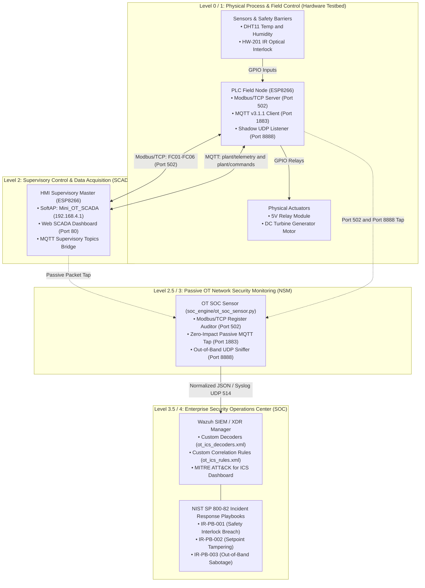

# 🛡️ ICS Laboratory: Mini Power Plant SCADA & OT Security Testbed
### Converged Modbus/TCP & MQTT Industrial Control System (Purdue Model Levels 0–4)

[](https://github.com/chinmayiM-bhise/ICS-Laboratory)
[](https://modbus.org/)
[](https://mqtt.org/)
[](https://www.nist.gov/publications/guide-industrial-control-systems-ics-security)
[](https://attack.mitre.org/matrices/ics/)
[](https://wazuh.com/)
[](https://opensource.org/licenses/MIT)

> **ICS Laboratory** is an authentic, hardware-based Industrial Control System (ICS) and Operational Technology (OT) testbed modeling a distributed Mini Power Plant. Architected across **Purdue Model Levels 0 through 4**, it implements a **dual-protocol architecture**: a physical field PLC (ESP8266) operating a **Modbus/TCP Server on Port 502** for deterministic field I/O alongside an **MQTT v3.1.1 Client on Port 1883** for supervisory SCADA telemetry.
>
> The environment demonstrates critical industrial vulnerabilities grounded in real-world critical infrastructure disasters—including **TRITON/TRISIS**, **Stuxnet**, **Oldsmar Water Treatment**, **Industroyer**, and the **Aurora Generator Attack**—and pairs them with a **Passive OT Network Security Monitoring (NSM) Sensor** emitting normalized JSON/Syslog alerts into **Wazuh SIEM** with official **MITRE ATT&CK for ICS** mappings and **NIST SP 800-82** Incident Response Playbooks.

---

## 🏛️ System Architecture (Purdue Model Integration)



---

## 🗺️ PLC Modbus/TCP Register Memory Map (TCP Port 502)

The field controller implements standard Modbus function codes: **FC 01** (Read Coils), **FC 02** (Read Discrete Inputs), **FC 03** (Read Holding Registers), **FC 04** (Read Input Registers), **FC 05** (Write Single Coil), and **FC 06** (Write Single Register):

| Register Type | Modbus Address | Hex Offset | Function Code | Data Type | Engineering Units / Meaning |
| :--- | :---: | :---: | :---: | :---: | :--- |
| **Coil (Read/Write)** | `00001` | `0x0000` | FC 01, FC 05 | 1 Bit | **Turbine Motor Relay:** `0 = OFF`, `1 = ON` |
| **Coil (Read/Write)** | `00002` | `0x0001` | FC 01, FC 05 | 1 Bit | **Emergency Stop (E-Stop) Trip:** `1 = TRIPPED` |
| **Discrete Input (RO)**| `10001` | `0x0000` | FC 02 | 1 Bit | **IR Optical Safety Barrier:** `0 = CLEAR`, `1 = TRIPPED` |
| **Discrete Input (RO)**| `10002` | `0x0001` | FC 02 | 1 Bit | **Hazard Alarm Status:** `0 = NORMAL`, `1 = ALARM` |
| **Input Register (RO)**| `30001` | `0x0000` | FC 04 | 16-Bit UInt | **Core Temperature:** Value $\times 10$ (e.g. $245 = 24.5^\circ\text{C}$) |
| **Input Register (RO)**| `30002` | `0x0001` | FC 04 | 16-Bit UInt | **Core Humidity:** Value $\times 10$ (e.g. $520 = 52.0\%$) |
| **Input Register (RO)**| `30003` | `0x0002` | FC 04 | 16-Bit UInt | **Generator Power Output:** Value $\times 100$ (e.g. $450 = 4.50\text{ kW}$) |
| **Input Register (RO)**| `30004` | `0x0003` | FC 04 | 16-Bit UInt | **Coolant Pressure:** Value $\times 100$ (e.g. $820 = 8.20\text{ Bar}$) |
| **Holding Register (RW)**| `40001` | `0x0000` | FC 03, FC 06 | 16-Bit UInt | **Safety Trip Threshold:** Value $\times 10$ (e.g. $300 = 30.0^\circ\text{C}$) |

---

## 🔍 Vulnerability Matrix & Real-World OT Case Studies

| Vulnerability | MITRE ATT&CK for ICS | Real-World Incident | Protocol Vector | Industrial Threat & Physical Impact |
| :--- | :---: | :--- | :---: | :--- |
| **1. Broken Safety Interlock ("Production Over Safety")** | **T0888** *(Loss of Safety)*<br>**T0831** *(Manipulation of Control)* | **TRITON / TRISIS (2017)**<br>Targeted petrochemical SIS controllers to disable emergency shutdown logic. | Modbus FC05 (Coil 00001)<br>MQTT `plant/commands` | Supervisory overrides bypass local physical optical barrier (IR sensor); motor spins despite active entanglement hazard. |
| **2. Critical Setpoint Parameter Tampering** | **T0836** *(Modify Parameter)* | **Oldsmar Water Treatment (2021)** & **Stuxnet (2010)**<br>Oldsmar altered lye to 11,100 ppm; Stuxnet modified centrifuge frequencies. | Modbus FC06 (Reg 40001)<br>MQTT `plant/config` | Setpoint register set to extreme value (`9999` $\rightarrow 999.9^\circ\text{C}$), neutralizing automated thermal cooling protection. |
| **3. Unauthenticated Control Injection** | **T0855** *(Unauthorized Command Message)* | **Industroyer / CrashOverride (2016)**<br>Sent unauthenticated protocol frames (IEC-104) to de-energize substation breakers. | Modbus FC05 (Port 502)<br>MQTT `plant/commands` | Unauthenticated Modbus/MQTT commands actuate relays directly from unauthorized hosts on the subnet. |
| **4. Actuator Flapping / Cycling DoS** | **T0814** *(Denial of Service)* | **Aurora Generator Test (2007)**<br>Rapidly opening and closing circuit breakers out-of-phase physically destroyed a generator. | Modbus FC05 (Coil 00001)<br>MQTT `plant/commands` | Rapidly bursting motor commands (`1 -> 0 -> 1 -> 0`) causes mechanical fatigue, contact arcing, and relay burnout. |
| **5. Out-of-Band Hardware Backdoor** | **T0859** *(Alternate Interfaces)*<br>**T0806** *(Brute Force I/O)* | **ICS Firmware Shadow Ports**<br>Vendor maintenance interfaces left active on field controllers. | UDP Port `8888` | Raw UDP socket writes directly to GPIO registers, completely bypassing supervisory HMI and SCADA logs. |
| **6. Denial of View via Telemetry Replay** | **T0815** *(Denial of View)*<br>**T0839** *(Module Firmware)* | **Stuxnet (2010)**<br>Replayed 21 days of pre-recorded normal telemetry to WinCC screens during sabotage. | MQTT `plant/telemetry` | Attacker replays static benign telemetry (`22.0°C`) to keep operators blind while core temperature escalates dangerously. |
| **7. Cleartext SCADA Sniffing** | **T0887** *(Wireless Sniffing)*<br>**T0830** *(Adversary-in-the-Middle)* | **Legacy SCADA Infrastructure**<br>Unencrypted operational protocols (Modbus, DNP3, plain MQTT 1883). | Modbus Port 502<br>MQTT Port 1883 | Full register maps, process variables, and command parameters visible in cleartext over the air. |
| **8. Default Vendor Credentials** | **T0812** *(Default Credentials)* | **CISA ICS Advisories**<br>PLCs deployed across critical infrastructure with unchanged static factory keys. | Firmware Binary | Plaintext Wi-Fi pre-shared key (`admin123`) and default static client IDs hardcoded in compiled binary. |
| **9. Automated Register / Topic Discovery** | **T0802** *(Automated Collection)*<br>**T0811** *(Data from Repositories)* | **SCADA Reconnaissance**<br>Unrestricted polling of memory maps and wildcard subscriptions. | Modbus FC01-FC04<br>MQTT `plant/#` | Complete plant topology and memory registers harvested in seconds without authentication. |

---

## 🛡️ Wazuh SIEM Decoders & Custom Detection Rules

Because field-level PLCs (Purdue Level 1) cannot host SIEM forwarders due to severe hardware constraints, the **OT SOC Sensor** (`soc_engine/ot_soc_sensor.py`) operates as a **zero-impact passive network monitor** at Level 2/3, parsing both Modbus/TCP frames and MQTT payloads and feeding normalized events into **Wazuh**:

| Rule ID | Level | Classification | MITRE ID | Detection Trigger |
| :---: | :---: | :--- | :---: | :--- |
| `100201` | **12 (Critical)** | Safety Interlock Violation | `T0888` | Actuator motor is energized while optical safety interlock is `TRIPPED` (Modbus Coil 00001=1 & Discrete 10001=1). |
| `100202` | **13 (Critical)** | Setpoint Parameter Tampering | `T0836` | Thermal trip threshold setpoint commanded outside safety limits via Modbus Reg 40001 or MQTT `plant/config`. |
| `100203` | **14 (Emergency)**| Direct PLC Hardware Backdoor | `T0859` | Direct-to-controller UDP packet received on maintenance port `8888`. |
| `100204` | **10 (High)** | Unauthorized Command Injection | `T0855` | Unauthenticated supervisory command injected into Modbus Port 502 or MQTT `plant/commands`. |
| `100205` | **9 (Warning)** | Telemetry Replay / Denial of View| `T0815` | Flatline telemetry detected while plant is operating under high load. |
| `100206` | **11 (High)** | Thermal Trip Failure | `T0888` | Temperature exceeds threshold setpoint without cooling actuation. |
| `100207` | **12 (Critical)** | Actuator Flapping DoS | `T0814` | More than 3 actuation state changes detected within a 5-second window. |

> Complete decoders and rule files are located in [`wazuh/decoders/ot_ics_decoders.xml`](wazuh/decoders/ot_ics_decoders.xml) and [`wazuh/rules/ot_ics_rules.xml`](wazuh/rules/ot_ics_rules.xml). See the [Wazuh Integration Guide](wazuh/WAZUH_INTEGRATION_GUIDE.md) for deployment steps.

---

## 📋 SOC Incident Response Playbooks

Structured following **NIST SP 800-82 Rev 2** and **NIST SP 800-61**:

* [**IR-PB-001: Unauthorized Actuation & Safety Interlock Breach (T0888 / T0855)**](playbooks/IR-PB-001_Safety_Interlock_Breach.md)
  * *Triage, containment (LOTO & E-Stop), eradication, and firmware-level logic hardening.*
* [**IR-PB-002: Critical Setpoint Parameter Tampering & Process Manipulation (T0836)**](playbooks/IR-PB-002_Critical_Setpoint_Tampering.md)
  * *Operational verification, reverting to Golden Baseline setpoint, and input bounds checking.*
* [**IR-PB-003: Out-of-Band Controller Sabotage & Maintenance Backdoor (T0859)**](playbooks/IR-PB-003_Out_Of_Band_PLC_Sabotage.md)
  * *Subnet isolation, UDP port 8888 firewall filtering, volatile state flush, and binary re-flashing.*

---

## 🔌 Hardware Specifications & Pinout Map

| Component | ESP8266 Pin | GPIO | Operating Voltage | Function |
| :--- | :---: | :---: | :---: | :--- |
| **DHT11 Environmental Sensor** | `D2` | GPIO4 | 3.3V | Core Temperature & Humidity Monitoring |
| **5V Relay Module (Actuator)** | `D5` | GPIO14 | 5V (Vin) | Actuates DC Turbine / Cooling Motor |
| **HW-201 IR Obstacle Sensor** | `D6` | GPIO12 | 3.3V | Optical Safety Interlock Barrier (Active LOW) |
| **Green LED Indicator** | `D7` | GPIO13 | 3.3V | Normal Operation Status |
| **Red LED Indicator** | `D8` | GPIO15 | 3.3V | Safety Trip / Hazard Alarm |
| **DC Turbine Motor** | — | — | 5V (Vin via Relay COM/NO) | Physical Generating Machine |

> See the full step-by-step schematic in the [Hardware Wiring Guide](HARDWARE_WIRING_GUIDE.md).

---

## 🚀 Quickstart Guide

### Option 1: Live Hardware Deployment

1. Wire components according to [`HARDWARE_WIRING_GUIDE.md`](HARDWARE_WIRING_GUIDE.md).
2. Install the **PubSubClient** and **DHT sensor** libraries in Arduino IDE.
3. Flash [`HMI_Node/HMI_Node.ino`](HMI_Node/HMI_Node.ino) to ESP8266 #1 (Supervisory Station).
4. Flash [`PLC_Node/PLC_Node.ino`](PLC_Node/PLC_Node.ino) to ESP8266 #2 (Field Controller).
5. Connect your laptop to the Wi-Fi AP **`Mini_OT_SCADA`** (Password: `admin123`).
6. Access the Web SCADA Dashboard at **`http://192.168.4.1`**.

---

### Option 2: Passive OT SOC Monitoring & Multi-Protocol Threat Simulation

Even without physical hardware connected, you can demonstrate the full SOC detection pipeline:

#### 1. Install Dependencies
```bash
git clone https://github.com/chinmayiM-bhise/ICS-Laboratory.git
cd ICS-Laboratory
pip install -r requirements.txt
```

#### 2. Start the Passive OT SOC Sensor
```bash
python soc_engine/ot_soc_sensor.py --broker 127.0.0.1 --plc-ip 127.0.0.1 --wazuh-host 127.0.0.1
```

#### 3. Inject Real-World Multi-Protocol Attack Scenarios
In another terminal, launch the automated threat injector:
```bash
python tools/ot_threat_injector.py
```
```
===================================================================
      HYBRID OT THREAT INJECTOR - ICS LABORATORY (CHINMAYI BHISE)
===================================================================
 [MODBUS/TCP EXPLOITATION - PORT 502]
  [1] Modbus FC 05: Force Motor Coil 00001 ON (Industroyer T0855)
  [2] Modbus FC 06: Tamper Threshold Register 40001 (Oldsmar T0836)
  [3] Modbus FC 01-04: Automated Memory Map Reconnaissance (T0802)

 [MQTT EXPLOITATION - PORT 1883]
  [4] MQTT TRITON: Safety Interlock Override (T0888)
  [5] MQTT OLDSMAR: Extreme Setpoint Manipulation (T0836)
  [6] MQTT AURORA: Actuator Relay Flapping DoS (T0814)

 [OUT-OF-BAND HARDWARE EXPLOITATION]
  [7] Direct UDP Backdoor Port 8888 (T0859)
  [8] Run Complete Automated Multi-Vector Attack Suite
  [0] Exit
===================================================================
```
Watch the OT SOC Sensor and Wazuh trigger live alerts in real time with corresponding MITRE ATT&CK for ICS rule IDs!

---

## 📂 Repository Structure

```
ICS-Laboratory/
├── HMI_Node/
│   └── HMI_Node.ino                    # Level 2 Supervisory Station & Web SCADA HMI
├── PLC_Node/
│   └── PLC_Node.ino                    # Level 1 Dual-Protocol PLC (Modbus/TCP + MQTT)
├── soc_engine/
│   └── ot_soc_sensor.py                # Passive OT NSM Sensor & Detection Gateway
├── wazuh/
│   ├── decoders/
│   │   └── ot_ics_decoders.xml         # Custom Wazuh Decoders for OT JSON Telemetry
│   ├── rules/
│   │   └── ot_ics_rules.xml            # Wazuh Rules Mapped to MITRE ATT&CK for ICS
│   └── WAZUH_INTEGRATION_GUIDE.md      # Wazuh SIEM Deployment Walkthrough
├── playbooks/
│   ├── IR-PB-001_Safety_Interlock_Breach.md
│   ├── IR-PB-002_Critical_Setpoint_Tampering.md
│   └── IR-PB-003_Out_Of_Band_PLC_Sabotage.md
├── tools/
│   └── ot_threat_injector.py           # Automated Real-World OT Adversary Simulator
├── HARDWARE_WIRING_GUIDE.md            # Electrical Pinout & Schematic Reference
├── OPERATIONAL_SETUP_GUIDE.md          # Commissioning & Startup Procedures
├── VULNERABILITY_REPORT.md             # In-Depth Industrial Vulnerability Assessment
├── VULNERABILITY_DEMO_GUIDE.md         # Hands-on Exploitation & Validation Guide
├── attack.html                         # IT/OT Cross-Boundary Web Trigger Demo
└── requirements.txt                    # Python Dependencies
```

---

## 📜 Disclaimer & Ethical Usage
This repository is developed for educational, defense research, and authorized auditing purposes only. All demonstrated vulnerabilities represent dangerous industrial failure modes and must never be implemented in production critical infrastructure.

## 📄 License
This project is licensed under the [MIT License](LICENSE).
