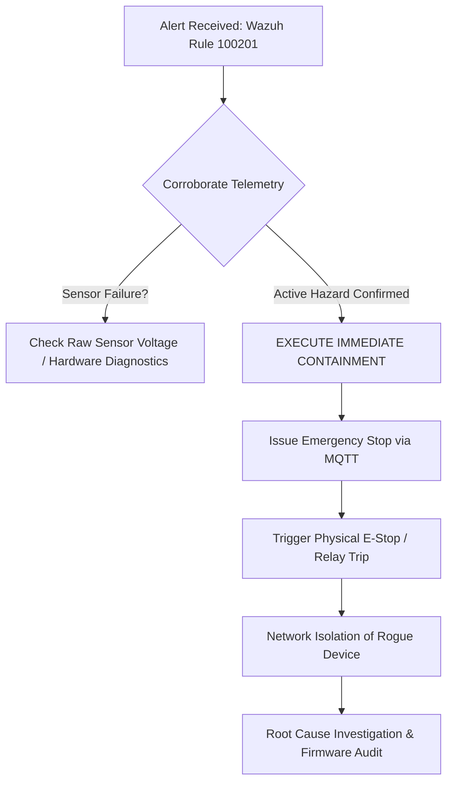

# 📋 SOC Incident Response Playbook: IR-PB-001
## Unauthorized Actuation & Safety Interlock Breach (T0888 / T0855)

| Metadata | Specification |
| :--- | :--- |
| **Playbook ID** | `IR-PB-001` |
| **Severity Level** | **CRITICAL (P1)** |
| **Associated Wazuh Rule** | `100201` (Level 12) |
| **MITRE ATT&CK for ICS** | **T0888** (Loss of Safety) / **T0855** (Unauthorized Command Message) |
| **Regulatory Standards** | NIST SP 800-82 Rev 2, ISA/IEC 62443-3-3, NERC CIP-007 |
| **Target Assets** | Level 1 Field PLC (`PLC_NODE_01`), Generation Motor Relay, IR Optical Interlock |

---

## 1. Incident Overview & Threat Context
* **Real-World Reference:** **TRITON / TRISIS Incident (2017)**. An adversary manipulated industrial safety instrumented logic to prevent an automatic safe shutdown when hazardous physical conditions arose.
* **Incident Scenario:** An operator or adversary has commanded the generator motor to run (`plant/commands -> {"motor": 1}`) while the physical safety barrier (IR Obstacle sensor) is tripped. The PLC firmware prioritizes the software MQTT command over local safety logic, risking catastrophic physical entanglement, motor burnout, or mechanical destruction.

---

## 2. Detection & Alert Indicators

### Wazuh SIEM Alert Signature
```json
{
  "rule_id": 100201,
  "rule_level": 12,
  "alert_type": "Safety Interlock Violation - Motor Active During Obstacle Hazard",
  "mitre_technique_id": "T0888",
  "details": {
    "motor_state": "RUNNING",
    "ir_sensor": "TRIPPED_OBSTACLE"
  }
}
```

### Telemetry Verification
* **MQTT Telemetry Topic:** `plant/telemetry`
* Verify payload: `"motor": 1` AND `"ir_obstacle": 1`.

---

## 3. Step-by-Step Triage Workflow



### Phase 1: Triage & Verification (Within 5 Minutes)
1. **Correlate with Physical Telemetry:** Check `plant/telemetry` to verify if temperature or pressure is escalating alongside the interlock trip.
2. **Rule out False Positive / Optical Sensor Noise:** Check if `ir_obstacle` toggles erratically (dust/vibration) or is held solid LOW. If solid LOW with motor active, treat as confirmed P1 life-safety hazard.
3. **Inspect MQTT Command Origin:** Identify the IP/MAC publishing to `plant/commands`. If not originating from the authorized HMI station (`192.168.4.1`), declare confirmed cyber intrusion.

---

## 4. Immediate Containment Procedures (Within 10 Minutes)

> [!CAUTION]
> In OT environments, **Physical Safety precedes Cyber Investigation**. Terminate mechanical actuation immediately before conducting log forensics.

1. **Software Emergency Halt:**
   Publish emergency shutdown payload to the supervisory broker:
   ```bash
   mosquitto_pub -h 192.168.4.1 -t "plant/commands" -m '{"emergency": 1}'
   ```
2. **Hard Physical De-Energization (LOTO):**
   * If software commands fail or are ignored, dispatch field personnel to trip the physical emergency stop button or disconnect relay coil power (GPIO14 / Relay VCC).
3. **Subnet Containment:**
   * Isolate the Rogue Client MAC address at the Wi-Fi AP layer or managed industrial switch.

---

## 5. Eradication, Remediation & Post-Incident Actions

1. **Firmware Remediation (Secure-by-Design):**
   * Patch `PLC_Node.ino` logic so that hardware safety sensor interrupts **strictly override** any software command:
     ```cpp
     // Hardened Safety Rule: Safety ALWAYS takes precedence over HMI
     if (isIrDetected) {
         digitalWrite(RELAY_PIN, LOW); // Force relay off regardless of override
         isMotorOn = false;
     }
     ```
2. **Broker Access Control:**
   * Enforce MQTT ACLs (`mosquitto.conf`) so only authenticated HMI credentials can publish to `plant/commands`.
3. **Post-Incident Review:**
   * Document timeline, calculate Mean Time to Detect (MTTD) and Mean Time to Respond (MTTR), and submit incident report to the OT Security Lead.
