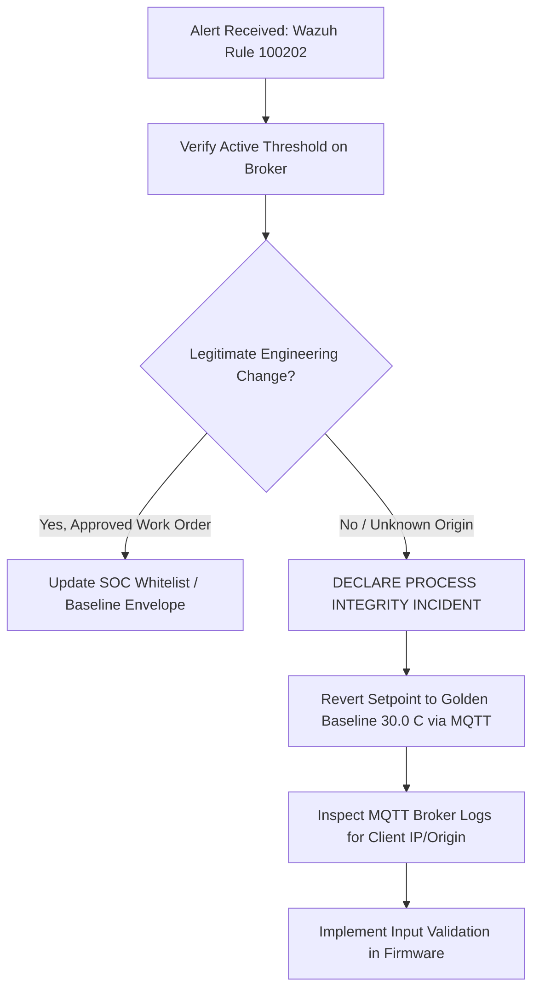

# 📋 SOC Incident Response Playbook: IR-PB-002
## Critical Setpoint Parameter Tampering & Process Manipulation (T0836)

| Metadata | Specification |
| :--- | :--- |
| **Playbook ID** | `IR-PB-002` |
| **Severity Level** | **HIGH / CRITICAL (P1/P2)** |
| **Associated Wazuh Rule** | `100202` (Level 13) |
| **MITRE ATT&CK for ICS** | **T0836** (Modify Parameter) / **T0855** (Unauthorized Command Message) |
| **Regulatory Standards** | NIST SP 800-82, IEC 62443-4-2, ISA TR84.00.09 |
| **Target Assets** | Supervisory Configuration Topic (`plant/config`), PLC Thermal Trip Setpoints |

---

## 1. Incident Overview & Threat Context
* **Real-World Reference:** **Oldsmar Water Treatment Facility (2021)** and **Stuxnet (2010)**. In Oldsmar, an attacker manipulated the sodium hydroxide (lye) concentration setpoint from 100 ppm to 11,100 ppm. In Stuxnet, rotor frequency boundaries were altered to tear centrifuges apart.
* **Incident Scenario:** An adversary publishes an unauthenticated MQTT message to `plant/config` setting the safety temperature threshold to an extreme or impossible value (e.g. `999999°C` or `-100°C`). By shifting the setpoint far outside physical operating limits, automated thermal trip mechanisms are neutralized, allowing temperatures to rise unchecked until physical fire or meltdown occurs.

---

## 2. Detection & Alert Indicators

### Wazuh SIEM Alert Signature
```json
{
  "rule_id": 100202,
  "rule_level": 13,
  "alert_type": "Critical Setpoint Parameter Tampered Beyond Physical Safety Limits",
  "mitre_technique_id": "T0836",
  "details": {
    "commanded_threshold": 999999.0,
    "allowed_safe_max": 45.0,
    "allowed_safe_min": 10.0
  }
}
```

### Telemetry Verification
* Ingest topic: `plant/config` or `plant/telemetry`.
* Check current active setpoint: `"threshold": > 45.0` or `< 10.0`.

---

## 3. Step-by-Step Triage Workflow



### Phase 1: Operational Verification (Within 10 Minutes)
1. **Check Maintenance Schedule / Work Orders:** Verify if plant engineers submitted an authorized MOC (Management of Change) request for thermal tuning.
2. **Review Current Core Temperatures:** Check `plant/telemetry` for temperature ramp rates. If temperatures are rising toward equipment breakdown (> 35°C), prioritize immediate thermal stabilization.

---

## 4. Containment Procedures

1. **Revert to "Golden Baseline" Setpoint:**
   Immediately force the safety threshold back to standard operational limits (30.0°C):
   ```bash
   mosquitto_pub -h 192.168.4.1 -t "plant/config" -m '{"threshold": 30.0}'
   ```
2. **Engage Cooling System:**
   Command the cooling fan/motor to run if the core is currently elevated:
   ```bash
   mosquitto_pub -h 192.168.4.1 -t "plant/commands" -m '{"motor": 1}'
   ```
3. **Block Rogue Publisher:**
   Disconnect unauthorized devices from the `Mini_OT_SCADA` access point.

---

## 5. Remediation & Long-Term Engineering Controls

1. **Firmware Boundary Validation (Sanity Checks):**
   * Update `PLC_Node.ino` to reject setpoints outside physical ranges `[15.0°C, 45.0°C]`:
     ```cpp
     if (newThresh >= 15.0 && newThresh <= 45.0) {
         safetyThreshold = newThresh;
     } else {
         Serial.println("[SECURITY REJECT] Threshold out of physical safety envelope!");
     }
     ```
2. **Configuration Authorization:**
   * Require cryptographic signing or dedicated administrator tokens for setpoint adjustments.
