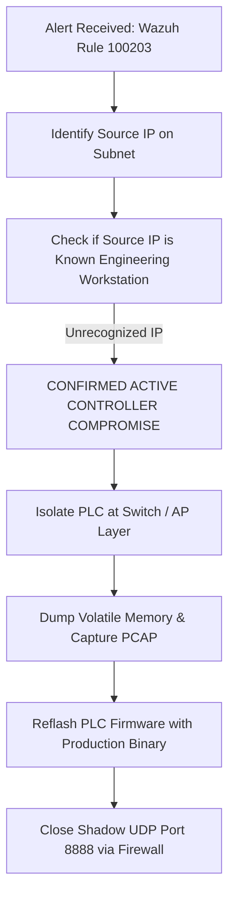

# 📋 SOC Incident Response Playbook: IR-PB-003
## Out-of-Band Controller Sabotage & Maintenance Backdoor Exploitation (T0859)

| Metadata | Specification |
| :--- | :--- |
| **Playbook ID** | `IR-PB-003` |
| **Severity Level** | **EMERGENCY (P0)** |
| **Associated Wazuh Rule** | `100203` (Level 14) |
| **MITRE ATT&CK for ICS** | **T0859** (Alternate Interfaces) / **T0806** (Brute Force I/O) |
| **Regulatory Standards** | NIST SP 800-82, IEC 62443-3-3, CISA ICS Alerts |
| **Target Assets** | Level 1 Field PLC (`PLC_NODE_01`), UDP Debug Port 8888 |

---

## 1. Incident Overview & Threat Context
* **Real-World Reference:** Legacy ICS controllers frequently contain undocumented test interfaces, factory maintenance ports, or shadow UDP listeners (e.g. Rockwell, Siemens, and Moxa auxiliary debug ports exposed to the control network).
* **Incident Scenario:** An adversary transmits raw UDP datagrams (`FORCE_MOTOR_ON`, `SABOTAGE`) directly to the PLC IP address on UDP port 8888. This bypasses the HMI supervisory dashboard and MQTT broker completely, manipulating hardware I/O pins directly at the controller register layer.

---

## 2. Detection & Alert Indicators

### Wazuh SIEM Alert Signature
```json
{
  "rule_id": 100203,
  "rule_level": 14,
  "alert_type": "Direct-to-PLC Out-of-Band Maintenance Backdoor Triggered",
  "mitre_technique_id": "T0859",
  "details": {
    "destination_port": 8888,
    "raw_command": "SABOTAGE",
    "impact": "Direct hardware register manipulation bypassing supervisory HMI."
  }
}
```

---

## 3. Step-by-Step Triage Workflow



### Phase 1: Threat Identification (Immediate)
1. **Identify Attacker Source IP:** Correlate with DHCP / ARP table on the Wi-Fi AP (`Mini_OT_SCADA`) to identify device hostname and MAC.
2. **Determine Injected Command:**
   * `FORCE_MOTOR_ON`: Uncontrolled mechanical energization.
   * `SABOTAGE`: Safety trip suppression (logic bomb armed).

---

## 4. Emergency Containment Procedures

1. **Subnet-Level Port Filter:**
   Drop all UDP traffic destined for port 8888 on the industrial switch or AP router:
   ```bash
   iptables -A FORWARD -p udp --dport 8888 -j DROP
   ```
2. **De-authenticate Attacker MAC:**
   Kick the attacking MAC address off the Wi-Fi AP or block the port on the managed switch.
3. **Reboot Field Controller:**
   Power-cycle the ESP8266 PLC node to flush the `sabotageMode` volatile state from RAM.

---

## 5. Eradication & Long-Term Hardening

1. **Remove Shadow Code from Firmware:**
   * Delete the `WiFiUDP udpBackdoor` instance and remove `udpBackdoor.begin(8888)` in production firmware.
2. **Firmware Cryptographic Hash Verification:**
   * Ensure future firmware deployments are digitally signed and verified via secure boot.
3. **Conduct External Port Audit:**
   * Scan all plant field devices with Nmap (`nmap -sU -p- <PLC_IP>`) to identify and eliminate lingering debug listeners.
